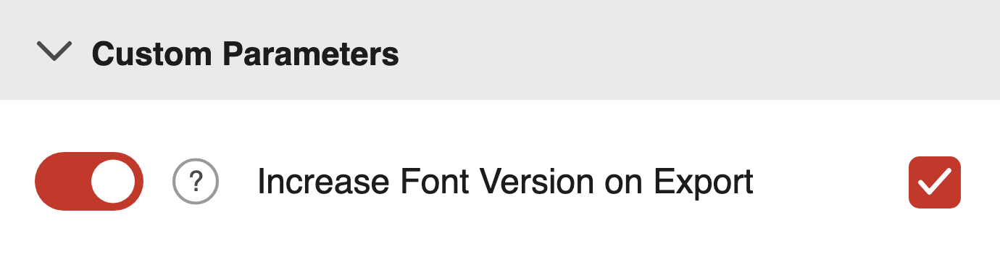

# 🔢 Increase Font Version on Export

**Version 1.0** — for Glyphs 3 and 4, macOS 10.15 or later.

By Giuseppe Salerno co-founder of [Resistenza Type](https://rsztype.com).

This is a plugin for the [Glyphs font editor](https://glyphsapp.com/). It automatically increases the font version by `0.001` every time you export — like [Numeratore](https://github.com/rsztype/Numeratore), but without the palette. No interface of its own: it is switched on with a real tick box in Font Info, and reads nothing else.



### Installation

1. Unzip the download and double-click `Increase Font Version on Export.glyphsPlugin` — Glyphs will offer to install it. (Alternatively, drop it into `~/Library/Application Support/Glyphs 3/Plugins/` or `~/Library/Application Support/Glyphs 4/Plugins/`.)

2. Restart Glyphs.app.

### Usage Instructions

1. Open a font, go to *Font Info ▸ Font ▸ Custom Parameters*, and click **+**.
2. Search **Increase Font Version on Export** — the plugin registers it at launch, so it is in the list with a tick box, not a name to type by hand.
3. Switch it on.
4. Export as usual (⌘E). The version is bumped by `0.001` after each export.

The increment lands in the source right after export, ready for the next one, so every exported file gets its own distinct, increasing version. A font that does not carry the parameter is left alone.

### Settings

Unlike a palette switch, this is a custom parameter — it belongs to the `.glyphs` file, not to your machine. Hand the document to someone else and it behaves the same for them. Written by hand, without the tick box, it looks like this:

```
{
customParameters = (
{
name = "Increase Font Version on Export";
value = 1;
},
);
}
```

### The version in the file name

Putting the version into the name of the exported file is not this plugin's job — Glyphs does that natively, with a template in the `fileName` parameter of an export:

```
{{{familyName}}}-{{{versionMajor}}}.{{{versionMinor}}}
```

`YourFont` at version `1.018` comes out as `YourFont-1.18.otf`. Paste that into the Custom Parameters of an **export**, not the font — Glyphs resolves it while writing the file, no plugin involved.

### Requirements

The plugin requires Glyphs 3 or Glyphs 4, running on macOS 10.15 or later. The bundle is universal, so it runs natively on both Apple Silicon and Intel.

### License

Copyright 2026 Giuseppe Salerno / Resistenza Type [rsztype.com](https://rsztype.com).

You may use, modify, and distribute this plugin freely. It is provided as-is, without warranty of any kind.
